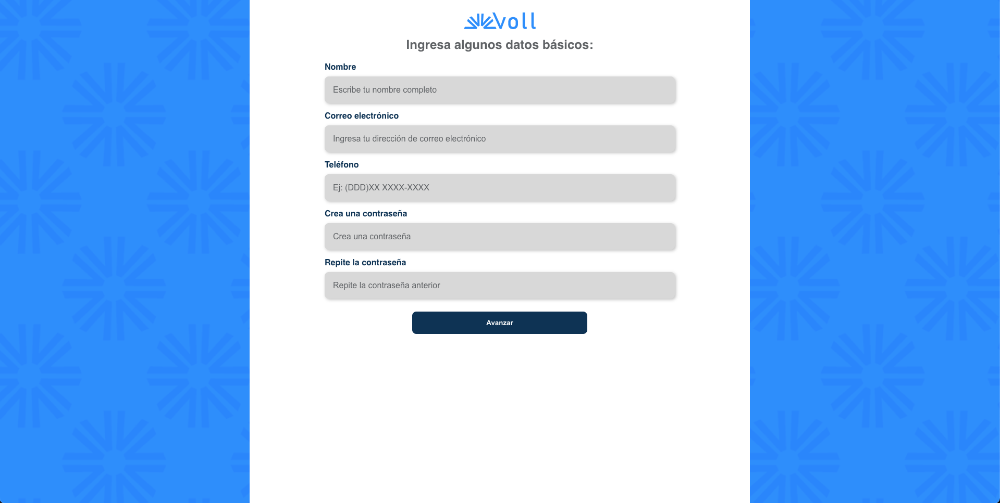

# Voll

Voll Med es una clínica especializada en conectar a los profesionales adecuados con los clientes. Actualmente se encuentra en la fase de desarrollo de su sitio web y aplicación, que cuentan con una gran cantidad de funcionalidades. Una de estas funcionalidades son sus formularios, los cuales necesitan incluir validación de datos para sus clientes.



## 🔨 Funcionalidades del proyecto

En esta etapa de desarrollo, Voll cuenta con las siguientes funcionalidades:

- Formulario de registro de pacientes.
- Formulario de registro de médicos especialistas.

El [Figma de esta aplicación lo encuentras aquí](https://www.figma.com/file/hsW25fAq36IDzzIxBtpgCd/Voll.med-%7C-React-Hook-Forms?type=design&node-id=57-1388&mode=design).

## ✔️ Tecnologías utilizadas

El proyecto utiliza las siguientes tecnologías y bibliotecas:

- `React` - Framework de JavaScript.
- `Vite` - Herramienta de compilación para desarrollo rápido.
- `TypeScript` - Lenguaje de programación principal.
- `Styled Components` - Herramienta para la estilización de nuestro proyecto.
- `Figma` - Para la prototipación del proyecto.

Y mucho más...

## 🛠️ Abrir y ejecutar el proyecto

Para ejecutar el proyecto Voll en tu entorno local, sigue estos pasos:

1. Asegúrate de tener Node.js instalado en tu máquina. Usamos la versión 20.10.0.

2. Descarga el repositorio del proyecto.

3. Extrae los archivos en una carpeta de tu preferencia.

4. Navega a la carpeta del proyecto usando el terminal (cmd):

```bash
cd react-forms
```  

5. Instala las dependencias usando npm, yarn o pnpm:

```bash
npm install
```

```bash
yarn add
```

```bash
pnpm install
```

6. Inicia el proyecto localmente:

```bash
npm run dev
```

```bash
yarn run dev
```

```bash
pnpm run dev
```

## 📚 Más información sobre el curso

¿Te gustó el proyecto y quieres saber más?

El diseño y prototipo de este proyecto se pueden encontrar [aqui](https://www.figma.com/file/hsW25fAq36IDzzIxBtpgCd/Voll.med-%7C-React-Hook-Forms?type=design&node-id=57-1388&mode=design). Si deseas continuar aprendiendo más sobre React, te recomiendo los cursos que tenemos disponibles [Cursos React](https://www.aluracursos.com/cursos-online-front-end)

Disfruta del desarrollo y mejora de Voll!
